# ERD Sistem Informasi Desa

## Diagram ERD (Notasi Chen)

```mermaid
flowchart TB
    subgraph ADMIN_DESA["🟦 ADMIN DESA"]
        AD_id((id_admin))
        AD_nama((nama))
        AD_email((email))
        AD_password((password))
        AD_role((role))
    end

    subgraph PENDUDUK["🟦 PENDUDUK"]
        P_id((id_penduduk))
        P_nik((nik))
        P_nama((nama))
        P_jk((jenis_kelamin))
        P_tgl_lahir((tanggal_lahir))
        P_tmp_lahir((tempat_lahir))
        P_alamat((alamat))
        P_agama((agama))
        P_status_nikah((status_pernikahan))
        P_pekerjaan((pekerjaan))
        P_hp((no_hp))
        P_status((status))
    end

    subgraph KELUARGA["🟦 KELUARGA"]
        K_id((id_keluarga))
        K_kk((no_kk))
        K_kepala((kepala_keluarga))
        K_nik_kepala((nik_kepala))
        K_dusun((dusun))
        K_rt((rt))
        K_rw((rw))
        K_alamat((alamat))
        K_jml((jumlah_anggota))
    end

    subgraph DUSUN["🟦 DUSUN"]
        D_id((id_dusun))
        D_nama((nama_dusun))
        D_kepala((kepala_dusun))
        D_rt((rt))
        D_rw((rw))
        D_jml_warga((total_warga))
    end

    subgraph SURAT["🟦 SURAT"]
        S_id((id_surat))
        S_nomor((nomor_surat))
        S_jenis((jenis_surat))
        S_tujuan((keperluan))
        S_tgl((tanggal_surat))
        S_status((status))
        S_data((data_tambahan))
    end

    subgraph PERMOHONAN["🟦 PERMOHONAN SURAT"]
        PS_id((id_permohonan))
        PS_kode((kode_pengajuan))
        PS_pemohon((nama_pemohon))
        PS_nik((nik_pemohon))
        PS_jenis((jenis_surat))
        PS_ket((keterangan))
        PS_status((status))
        PS_tgl((tanggal))
    end

    subgraph BERITA["🟦 BERITA"]
        B_id((id_berita))
        B_judul((judul))
        B_isi((isi))
        B_kategori((kategori))
        B_tgl((tanggal_publikasi))
        B_penulis((penulis))
    end

    %% RELASI
    ADMIN_DESA ---|"mengelola (0,N)→(1,1)"| BERITA
    ADMIN_DESA ---|"mengelola (0,N)→(1,1)"| DUSUN
    ADMIN_DESA ---|"mengelola (0,N)→(1,1)"| KELUARGA
    ADMIN_DESA ---|"mengelola (0,N)→(1,1)"| PENDUDUK
    PENDUDUK ---|"membuat (0,N)→(1,1)"| SURAT
    PENDUDUK ---|"untuk (0,N)→(1,1)"| SURAT
    PENDUDUK ---|"mengajukan (0,N)→(1,1)"| PERMOHONAN
    ADMIN_DESA ---|"memverifikasi (0,N)→(1,1)"| PERMOHONAN
    KELUARGA ---|"beranggotakan (1,N)→(0,1)"| PENDUDUK
    DUSUN ---|"memiliki (1,N)→(1,1)"| KELUARGA
    PERMOHONAN ---|"menghasilkan (0,1)→(0,1)"| SURAT
```



---

## Deskripsi Entitas

### 1. ADMIN DESA
| Atribut | Tipe | Keterangan |
|---------|------|------------|
| id_admin | INT | Primary Key |
| nama | VARCHAR(100) | Nama admin |
| email | VARCHAR(100) | Email (unik) |
| password | VARCHAR(255) | Password terenkripsi |
| role | ENUM | admin_desa, admin, user_surat |

### 2. PENDUDUK
| Atribut | Tipe | Keterangan |
|---------|------|------------|
| id_penduduk | INT | Primary Key |
| nik | VARCHAR(16) | NIK (unik) |
| nama | VARCHAR(100) | Nama lengkap |
| jenis_kelamin | ENUM | Laki-laki, Perempuan |
| tanggal_lahir | DATE | Tanggal lahir |
| tempat_lahir | VARCHAR(100) | Tempat lahir |
| alamat | TEXT | Alamat lengkap |
| agama | VARCHAR(50) | Agama |
| status_pernikahan | ENUM | Belum Menikah, Menikah, Cerai, Janda/Duda |
| pekerjaan | VARCHAR(100) | Pekerjaan |
| no_hp | VARCHAR(15) | Nomor HP |
| status | ENUM | aktif, pindah, meninggal |
| email | VARCHAR(100) | Email (opsional, jika punya login) |
| password | VARCHAR(255) | Password terenkripsi (opsional, jika punya login) |
| role | ENUM | admin, user_surat, user_penduduk (opsional) |
| is_approved | BOOLEAN | Status approval akun (opsional) |
| id_keluarga | INT | FK → KELUARGA (opsional) |

### 3. KELUARGA
| Atribut | Tipe | Keterangan |
|---------|------|------------|
| id_keluarga | INT | Primary Key |
| no_kk | VARCHAR(16) | Nomor Kartu Keluarga (unik) |
| kepala_keluarga | VARCHAR(100) | Nama kepala keluarga |
| nik_kepala | VARCHAR(16) | NIK kepala keluarga |
| rt | VARCHAR(5) | RT |
| rw | VARCHAR(5) | RW |
| alamat | TEXT | Alamat lengkap |
| kode_pos | VARCHAR(10) | Kode pos |
| jumlah_anggota | INT | Jumlah anggota keluarga |
| id_dusun | INT | FK → DUSUN (opsional) |

### 4. DUSUN
| Atribut | Tipe | Keterangan |
|---------|------|------------|
| id_dusun | INT | Primary Key |
| nama_dusun | VARCHAR(50) | Nama dusun |
| kepala_dusun | VARCHAR(100) | Nama kepala dusun |
| rt | VARCHAR(5) | RT |
| rw | VARCHAR(5) | RW |
| total_warga | INT | Total jumlah warga |

### 5. SURAT
| Atribut | Tipe | Keterangan |
|---------|------|------------|
| id_surat | INT | Primary Key |
| nomor_surat | VARCHAR(50) | Nomor surat (unik) |
| jenis_surat | VARCHAR(100) | Jenis surat |
| keperluan | TEXT | Keperluan/tujuan surat |
| tanggal_surat | DATE | Tanggal surat |
| status | ENUM | draft, selesai, dicetak |
| data_tambahan | JSON | Data tambahan |
| nama_kepala_desa | VARCHAR(100) | Nama kepala desa penandatangan |
| id_penduduk | INT | FK → PENDUDUK (pemilik surat) |
| id_penduduk_pembuat | INT | FK → PENDUDUK (yang membuat, admin/user_surat) |

### 6. PERMOHONAN SURAT
| Atribut | Tipe | Keterangan |
|---------|------|------------|
| id_permohonan | INT | Primary Key |
| kode_pengajuan | VARCHAR(20) | Kode pengajuan (unik) |
| nama_pemohon | VARCHAR(100) | Nama pemohon |
| nik_pemohon | VARCHAR(16) | NIK pemohon |
| jenis_surat | VARCHAR(100) | Jenis surat yang dimohon |
| keterangan | TEXT | Keterangan tambahan |
| status | ENUM | baru, diproses, selesai, ditolak |
| tanggal | TIMESTAMP | Tanggal pengajuan |
| id_penduduk | INT | FK → PENDUDUK (pemohon) |
| id_surat | INT | FK → SURAT (hasil, opsional) |
| id_admin | INT | FK → PENDUDUK/ADMIN (yang memverifikasi) |

### 7. BERITA
| Atribut | Tipe | Keterangan |
|---------|------|------------|
| id_berita | INT | Primary Key |
| judul | VARCHAR(200) | Judul berita |
| isi | TEXT | Isi berita |
| kategori | VARCHAR(50) | Kategori berita |
| tanggal_publikasi | DATE | Tanggal publikasi |
| id_admin | INT | FK → PENDUDUK/ADMIN (pengelola) |

---

## Tabel Lengkap: Entitas, Atribut, & Relasi

### TABEL 1: DAFTAR ENTITAS DAN ATRIBUT (7 Entities)

| No | Entitas | Daftar Atribut |
|----|---------|-----------------|
| 1 | **ADMIN_DESA** | id_admin (PK), nama, email (UK), password, role, created_at |
| 2 | **PENDUDUK** | id_penduduk (PK), nik (UK), nama, jenis_kelamin, tanggal_lahir, tempat_lahir, alamat, agama, status_pernikahan, pekerjaan, no_hp, status, email, password, role, is_approved, id_keluarga (FK), created_at |
| 3 | **KELUARGA** | id_keluarga (PK), no_kk (UK), kepala_keluarga, nik_kepala, rt, rw, alamat, kode_pos, jumlah_anggota, id_dusun (FK), created_at |
| 4 | **DUSUN** | id_dusun (PK), nama_dusun (UK), kepala_dusun, rt, rw, total_warga, created_at |
| 5 | **SURAT** | id_surat (PK), nomor_surat (UK), jenis_surat, keperluan, tanggal_surat, status, data_tambahan, nama_kepala_desa, id_penduduk (FK), id_penduduk_pembuat (FK), created_at |
| 6 | **PERMOHONAN_SURAT** | id_permohonan (PK), kode_pengajuan (UK), nama_pemohon, nik_pemohon, jenis_surat, keterangan, status, tanggal, id_penduduk (FK), id_surat (FK), id_admin (FK), created_at |
| 7 | **BERITA** | id_berita (PK), judul, isi, kategori, tanggal_publikasi, id_admin (FK), created_at |

**Keterangan:** PK = Primary Key | UK = Unique Key | FK = Foreign Key

---

### TABEL 2: RELASI DENGAN KARDINALITAS LENGKAP (10 Relasi)

| No | Entitas 1 | Min Card (Ent1) | Max Card (Ent1) | Relasi | Entitas 2 | Min Card (Ent2) | Max Card (Ent2) | Notasi | Penjelasan |
|----|-----------|-----------------|-----------------|--------|-----------|-----------------|-----------------|--------|------------|
| 1 | ADMIN_DESA | 0 | N | **mengelola** | BERITA | 1 | 1 | 1:N | Satu admin bisa kelola banyak berita. Satu berita hanya kelola 1 admin |
| 2 | ADMIN_DESA | 0 | N | **mengelola** | DUSUN | 1 | 1 | 1:N | Satu admin bisa kelola/manage banyak dusun. Satu dusun dikelola 1 admin |
| 3 | ADMIN_DESA | 0 | N | **mengelola** | KELUARGA | 1 | 1 | 1:N | Satu admin bisa kelola/verifikasi banyak data KK. Satu KK dikelola 1 admin |
| 4 | ADMIN_DESA | 0 | N | **mengelola** | PENDUDUK | 1 | 1 | 1:N | Satu admin bisa kelola/edit banyak data warga. Satu penduduk dikelola 1 admin |
| 5 | PENDUDUK | 0 | N | **membuat** | SURAT | 1 | 1 | 1:N | Satu penduduk (admin/user_surat) bisa buat banyak surat. Satu surat hanya dibuat 1 penduduk |
| 6 | PENDUDUK | 0 | N | **untuk** | SURAT | 1 | 1 | 1:N | Satu penduduk bisa punya banyak surat. Satu surat hanya untuk 1 penduduk |
| 7 | PENDUDUK | 0 | N | **mengajukan** | PERMOHONAN_SURAT | 1 | 1 | 1:N | Satu penduduk bisa ajukan banyak permohonan. Satu permohonan hanya dari 1 penduduk |
| 8 | ADMIN_DESA | 0 | N | **memverifikasi** | PERMOHONAN_SURAT | 1 | 1 | 1:N | Satu admin bisa verifikasi banyak permohonan surat. Satu permohonan hanya diverifikasi 1 admin |
| 9 | KELUARGA | 1 | N | **beranggotakan** | PENDUDUK | 0 | 1 | 1:N | Satu keluarga wajib punya min 1 anggota, bisa banyak. Satu penduduk max belong to 1 keluarga |
| 10 | DUSUN | 1 | N | **memiliki** | KELUARGA | 1 | 1 | 1:N | Satu dusun wajib punya min 1 keluarga, bisa banyak. Satu keluarga hanya di 1 dusun |

**Keterangan Kardinalitas:**
- **Min Card = 0**: Opsional (boleh tidak ada / tidak wajib)
- **Min Card = 1**: Wajib (harus ada minimal 1)
- **Max Card = 1**: Satu (hanya boleh 1)
- **Max Card = N**: Banyak (boleh lebih dari 1)

---

### TABEL 3: RINGKASAN NOTASI KARDINALITAS

| Notasi | Artinya | Contoh |
|--------|---------|---------|
| **(0,1)** | Opsional, maksimal satu | Pengguna boleh tidak punya data penduduk |
| **(0,N)** | Opsional, bisa banyak | Admin boleh tidak langsung verifikasi siapa-siapa |
| **(1,1)** | Wajib, hanya satu | Pengguna harus punya satu akun (tidak banyak) |
| **(1,N)** | Wajib, bisa banyak | Keluarga wajib punya minimal satu anggota |

---

### TABEL 4: VISUALISASI RELASI DALAM FORMAT DIAGRAM

```
Nomor 1:
ADMIN_DESA (0,N) ────◇mengelola◇──── (1,1) BERITA
Admin boleh belum kelola berita         Berita pasti dikelola 1 admin

Nomor 2:
ADMIN_DESA (0,N) ────◇mengelola◇──── (1,1) DUSUN
Admin boleh belum kelola dusun          Dusun harus dikelola 1 admin

Nomor 3:
ADMIN_DESA (0,N) ────◇mengelola◇──── (1,1) KELUARGA
Admin boleh belum kelola keluarga       Keluarga harus dikelola 1 admin

Nomor 4:
ADMIN_DESA (0,N) ────◇mengelola◇──── (1,1) PENDUDUK
Admin boleh belum kelola data warga     Penduduk harus dikelola 1 admin

Nomor 5:
PENDUDUK (0,N) ────◇membuat◇──── (1,1) SURAT
Penduduk (admin/user_surat) buat surat  Surat pasti dibuat 1 penduduk

Nomor 6:
PENDUDUK (0,N) ────◇untuk◇──── (1,1) SURAT
Penduduk boleh tidak punya surat        Surat pasti untuk 1 penduduk

Nomor 7:
PENDUDUK (0,N) ────◇mengajukan◇──── (1,1) PERMOHONAN_SURAT
Penduduk boleh tidak ajukan permohonan  Permohonan pasti dari 1 penduduk

Nomor 8:
ADMIN_DESA (0,N) ────◇memverifikasi◇──── (1,1) PERMOHONAN_SURAT
Admin boleh belum verifikasi permohonan Permohonan harus diverifikasi 1 admin

Nomor 9:
KELUARGA (1,N) ────◇beranggotakan◇──── (0,1) PENDUDUK
Keluarga WAJIB punya 1+ anggota         Penduduk boleh tidak tercatat di KK

Nomor 10:
DUSUN (1,N) ────◇memiliki◇──── (1,1) KELUARGA
Dusun WAJIB punya 1+ keluarga           Keluarga pasti di 1 dusun
```